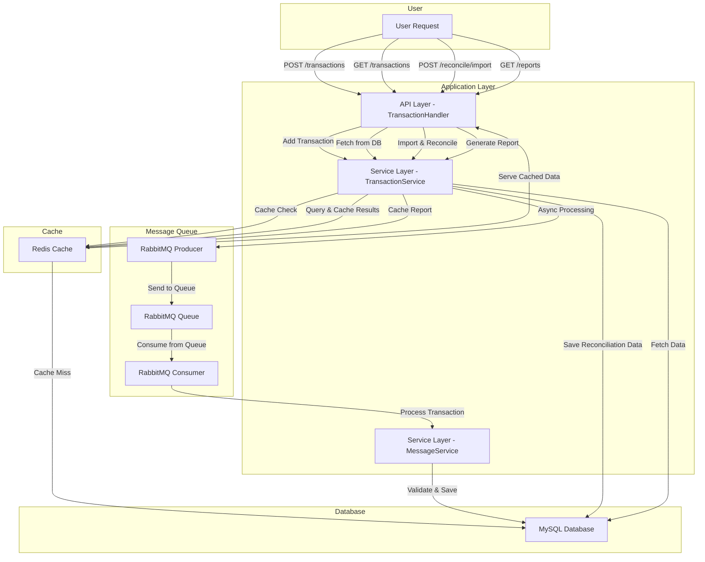

# Financial tracking System

## Assignment Details

1. :white_check_mark: As a user, I want to be able to record my daily income and expenses so that I can easily track and manage my financial situation.

2. :white_check_mark: As a user, I want to be able to import transaction records from bank or credit card statements and reconcile them automatically, which will save time and reduce manual input errors.

3. :white_check_mark: As a user, I want to generate monthly or annual financial reports, making it easier for me to review and analyze my financial status.

4. :white_check_mark: Design table structures and indexes, write the main code, and consider scenarios of high traffic and concurrency (you can use pseudocode for implementation).

## Repository Structure

> [!NOTE]
> Tech Stack：Golang、Gin、Gorm、Redis、RabbitMQ、MySQL、Wire DI

> [!WARNING]
> Architecture can and should be optimized

```markdown
.
├── cmd
│   └── main.go
├── config
│   └── config.go
├── internal
│   ├── api
│   │   └── api.go
│   ├── cache
│   │   └── redis.go
│   ├── db
│   │   └── db.go
│   ├── handler
│   │   ├── api.go
│   │   └── msg.go
│   ├── mq
│   │   └── rabbitmq.go
│   ├── service
│   │   ├── api.go
│   │   └── msg.go
│   └── entity
│       └── transaction.go
└── README.md
```

### Explanation

1. API Layer:
   - Handles user requests and forwards them to the service layer for processing.

2. Service Layer:
    - TransactionService: Responsible for managing the business logic related to adding, querying, importing transaction records, and generating reports.
    - MessageService: Responsible for processing messages consumed from RabbitMQ, including transaction validation and storage.

3. Redis Cache:
    - Used to speed up data retrieval and reduce the load on MySQL.
    - When querying data, it first checks the Redis cache. If there’s a cache hit, it returns the data directly; otherwise, it queries MySQL and stores the result in the cache.

4. RabbitMQ Message Queue:
    - Provides asynchronous processing capabilities by pushing transaction write operations to the queue, thereby reducing the direct load on MySQL.
    - Consumers read messages from the queue, and MessageService handles them, completing transaction validation and saving.

5. MySQL Database:
    - Serves as the core for persistent storage, responsible for saving all transaction records, reconciliation data, and generated reports.

## Arch



## API

### 1. Add Transaction

> [!TIP]
> **Discription** : Users can submit a transaction record

#### Endpoint

   ```plaintext
    POST /transactions
   ```

#### Request

**Body** :

   ```json
    {
        "id": "1",
        "user_id": "user123",
        "date": "2024-09-02T03:34:43Z",
        "amount": 100.0,
        "category": "INCOME",
        "description": "Salary",
        "source": "MANUAL"
    }
   ```

#### Response

**Status** : 202 Accepted  
**Body** :

   ```json
    {
        "message": "Transaction received and will be processed"
    }
   ```

### 2. Get Transactions

> [!TIP]
> **Discription** :  Retrieves user transactions with support for filtering and pagination.

#### Endpoint

   ```plaintext
    GET /transactions
   ```

#### Query Parameters

- **user_id** (required): The user ID.
- **category** (optional): Filter by category (e.g., INCOME, EXPENSE).
- **start_date** (optional): Start date (format: YYYY-MM-DD).
- **end_date** (optional): End date (format: YYYY-MM-DD).
- **page** (optional): Page number, default is 1.
- **page_size** (optional): Number of transactions per page, default is 10.

#### Response

**Status** : 200 OK  
**Body** :

   ```json
    [
        {
            "id": "1",
            "user_id": "user123",
            "date": "2024-09-02T03:34:43Z",
            "amount": 100.0,
            "category": "INCOME",
            "description": "Salary",
            "source": "MANUAL",
            "reconciled": false
        }
    ]
   ```

### 3. Import Reconcile

> [!TIP]
> **Discription** :  mports user transaction records, such as from bank or credit card statements, and performs reconciliation

#### Endpoint

   ```plaintext
    POST /reconcile/import
   ```

#### Request

**Body** : File upload or transaction data, depending on the required format.

#### Response

**Status** : 202 Accepted  
**Body** :

   ```json
    {
        "message": "Transactions imported successfully"
    }
   ```

### 4. Generate and Retrieve Financial Reports

> [!TIP]
> **Discription** : Generates a financial report for the user, supporting monthly or yearly views.

#### Endpoint

   ```plaintext
    GET /reports
   ```

#### Query Parameters

- **user_id** (required): The user ID.
- **eport_type** (required): Type of report (e.g., MONTHLY, YEARLY).
- **start_date** (required): Start date of the report (format: YYYY-MM-DD).
- **end_date** (required): End date of the report (format: YYYY-MM-DD).

#### Response

**Status** : 200 OK  
**Body** :

   ```json
    {
        "user": "user123",
        "period": "2024-01-01 - 2024-12-31",
        "entries": [
            {
            "id": "1",
            "user_id": "user123",
            "date": "2024-09-02T03:34:43Z",
            "amount": 100.0,
            "category": "INCOME",
            "description": "Salary",
            "source": "MANUAL",
            "reconciled": false
            }
        ]
    }
   ```

## DB Table Design

> [!WARNING]
> DB Table can and should be optimized

### 1. Transactions Table

> [!TIP]
> **Purpose** : Stores all transaction records including income, expenses, and imported data from bank or credit card statements.

**Structure** :

| Column | Data Type | Description |
| ------ | --------- | ----------- |
|id|UUID|Primary key, uniquely identifies each transaction.|
|user_id|UUID|Foreign key referencing the user making the transaction.|
|date|DATE|Date of the transaction. Indexed for fast queries.|
|amount|DECIMAL(10,2)|The amount of the transaction.|
|category|VARCHAR(50)|Category of the transaction (e.g., INCOME, EXPENSE).|
|desciption|TEXT|Detailed description of the transaction.|
|source|ENUM(‘MANUAL’, ‘BANK’, ‘CREDIT_CARD’)|Source of the transaction, whether it was manually entered, or imported from a bank or credit card statement.|
|reconciled|BOLLEAN|Indicates if the transaction has been reconciled.|

**Indexes** :

- (user_id, date): To speed up queries when filtering by user and date.
- (date): For fast range queries, especially for reports.

### 2. Accounts Table

> [!TIP]
> **Purpose** : Manages different accounts linked to a user, such as bank accounts, credit cards, or cash.

**Structure** :

| Column | Data Type | Description |
| ------ | --------- | ----------- |
|id|UUID|Primary key, uniquely identifies each account.|
|user_id|UUID|Foreign key linking to the user owning the account.|
|account_name|VARCHAR(100)|Name of the account (e.g., Checking, Savings).|
|account_type|ENUM(‘BANK’, ‘CREDIT_CARD’, ‘CASH’)|Type of the account.|

**Indexes** :

- (user_id, start_date, end_date): Optimizes report generation and ensures that reports are correctly grouped and filtered by user and time period.

### Feedback and suggestions are very welcomed
